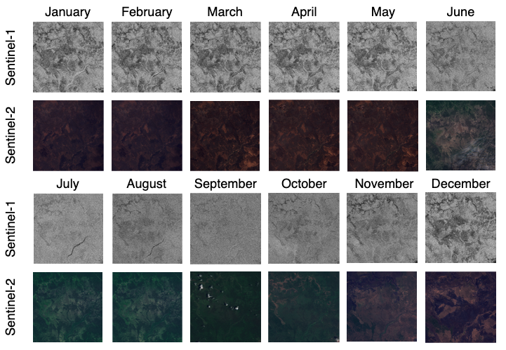
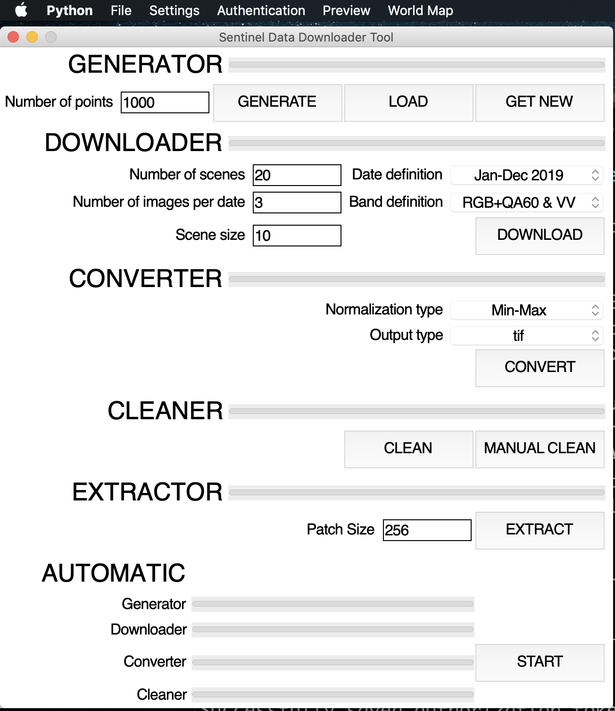
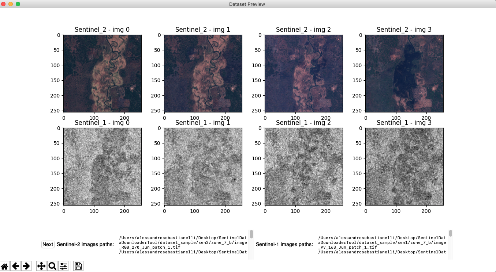
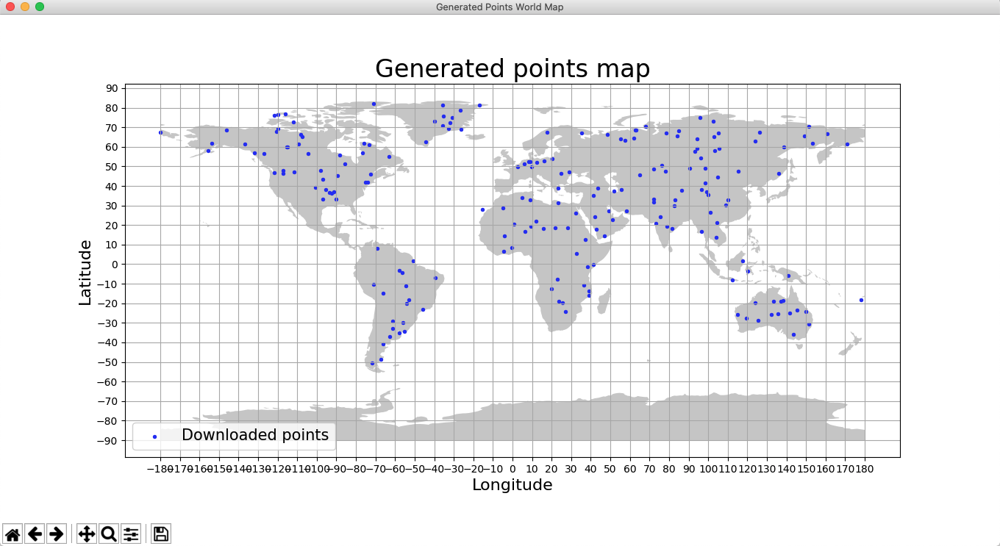
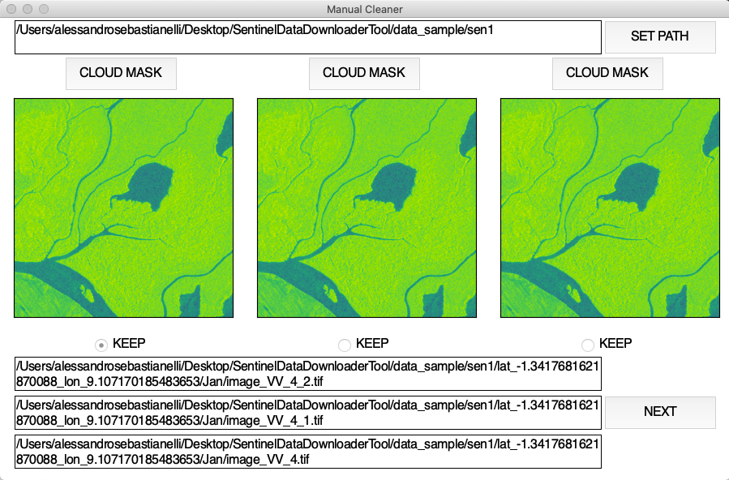

## Work in progress, actions needed:
- [ ] Code cleaning (some scripts must be better written and path management for the various operating systems must be fixed.
- [ ] Add patch extractor code
- [X] Add GUI code
- [ ] Update manual
- [X] Add manual cleaner 
- [X] Create GUI
- [ ] Manual Cleaner to widget 
- [ ] Add functionalities to GUI
- [ ] Testing

# Sentinel Data Downloader Tool

###### By Alessandro Sebastianelli
## Description
This tool has been designed to build datasets for machine learning  and  deep learning applications in a simple and automatic way. A set of scripts allows the user to automatically download images from the Google Earth Engine. The parameters to be set are a few and among these there are the coordinates of the area of interest, the dates, the data bands,the number of images. As one can see from the figure below, the tool is composed of several functional blocks, each dealing with a particular task.

- The **generator** generates random points, with longitude and latitude, distributed over the Earth surface. Since Sentinels do not acquire data on water bodies, it was necessary to introduce a water masking function into the generation process. The water mask allows identifying and delimiting water-rich areas of the Earth at a certain resolution. To generate the points two random variables with uniform distribution were used: for the latitude the range was (-56, 84), because Sentinel-2 does not acquire data outside of this interval, instead for the longitude where there are no constraints, the interval (-180, 180) was chosen. At each iteration a point is generated, and through the water mask it is verified if the point is on the solid land; if so, the point is saved, if not, it is dumped and the next one generated.
- The **downloader** takes care of downloading the images from the coordinates previously generated and from the date in which the time series is to be started. By default the script will try to download a one-year time series, with a monthly interval. For each month three Sentinel-1 images and three Sentinel-2 images are downloaded; this number was chosen to guarantee at least one image for each satellite that is in optimal conditions of light, cloud coverage, etc. The software is also designed to organize data in a hierarchical folder structure.
- The **converter** mainly deals with taking raw data, which typically have a .tif extension, and converting them into arrays. For Sentinel-1 products the converter first standardizes or normalizes the data to bring them into a range suitable for machine learning purposes. For Sentinel-2 products, the converter normalizes or standardizes the data, then through the RGB bands it builds a color image.
- The **cleaner** mainly deals with selecting for each satellite, for each region, for each date, the best image available among the three downloaded. Using the 3 images (default value) per month the cleaner selects the best image for each month. In fact there are some ”errors” in the downloaded data. For example some Sentinel-1 downloaded data present some areas with invalid values. Some Sentinel-2 downloaded data present the same problem but in addition there can be images with relevant cloud coverage. For the missing parts the software uses a threshold, for the clouds detection the user can select a cloud masking method.
- The **patch extractor** is an add-on that extracts precisely from the final image under smaller images to increase the samples in the dataset. It is optional because, as in the case of landslides, a landslide is typically centered in the image and therefore a patch extraction would result in the loss of information

###### For more information please contact: alessandro.sebastianelli1995@gmail.com

# User manual

To use the software run ***main.py***.

### Required packages
The code has been written in Python 3.6.8. You can easly install the following packages by running:

~~~
pip install <name of package>
~~~

- numpy
- matplotlib
- global-land-mask
- pillow
- earthengine-api
- scipy
- geetools
- pandas
- imageio
- scikit-image
- rasterio
- geopandas
- descartes

# Using the software with Jupyter Notebook

You can activate or deactivate the components. For example with these settings:

~~~python
generate   = True
download   = True
convert_s2 = True
convert_s1 = True
clean_s2   = True
clean_s1   = True
~~~	

all the components are activated. In this way you can split the workflow. **Keep attention!!! The order of the workflow (generator, downloader, converter and cleaner) must not be changed.**
 
## Generator
You can define the number of points to be generated. The default number is:

~~~python
n_of_points = 5000
~~~

After the generation the points are saved in the ***point.csv*** file located into the code folder. If you deactivate the generator, the points are loaded from that file.

~~~python
points_path = '/Users/alessandrosebastianelli/Desktop/downloader_tool/code/points.csv'
~~~

**Keep attention!!! You should change the existing path using the whole path of your file. Keep attention on the type of operative system you use.** 

The file is organized as follow:

|Point|Longitude|Latitude|
|:-:|:-:|:-:|
|1|71.00281|-178.6984|   
|2|49.01390|132.89771|   
|3|62.33937|37.118731|
|...|...|...| 

## Downloader

First of all you have to create some folders (into the "code" folder):

- Download folder: **download**
- Data folder: **data**
	- Sentinel-1 folder (inside "data"): **sen1**
	- Sentinel-2 folder (inside "data"): **sen2**
- Dataset folder: **dataset**
	- Sentinel-1 folder (inside "data"): **sen1**
	- Sentinel-2 folder (inside "data"): **sen2**

At this point you should have this structure:

- code
	- download
	- data
		- sen1
		- sen2
	- dataset
		- sen1
		- sen2

After that you have to change the path settings in the code:

~~~python
download_path = '/Users/alessandrosebastianelli/Desktop/SentinelDataDownloaderTool/code/download'
downloads_folder_path = download_path+'/*'
sen2_images_base_path = '/Users/alessandrosebastianelli/Desktop/SentinelDataDownloaderTool/code/data/sen2/'
sen1_images_base_path = '/Users/alessandrosebastianelli/Desktop/SentinelDataDownloaderTool/code/data/sen1/'
~~~  

**Keep attention!!! You should change the existing paths using the whole paths of the folders previously created. Keep attention on the type of operative system you use.** For example if you use Windows you should set:

~~~python
downloads_folder_path = r'C:\\Users\\alessandrosebastianelli\\Desktop\\downloader_tool\\code\\download\\*'
...
~~~

After that you can specify the start date and the end date vectors. The default settings are:

~~~python
start_date = ['2018-01-01','2018-02-01','2018-03-01','2018-04-01','2018-05-01','2018-06-01','2018-07-01','2018-08-01','2018-09-01','2018-10-01','2018-11-01','2018-12-01']
end_date =   ['2018-01-28','2018-02-28','2018-03-28','2018-04-28','2018-05-28','2018-06-28','2018-07-28','2018-08-28','2018-09-28','2018-10-28','2018-11-28','2018-12-28']
~~~

you should set also the date name. The default setting is:

~~~python
date_names = ['Jan','Feb','Mar','Apr','May','Jun','Jul','Aug','Sep','Oct','Nov','Dec']
~~~

and the number of image for each time interval. The default setting is:

~~~python
n_images = 3
~~~

With these settings the software will try to download a 1 year time series, with a monthly interval. For each month 3 Sentinel-1 and 3 Sentinel-2 images will be downloaded. 

After that you should specify the Sentinel-2 and Sentinel-1 bands that have to be downloaded. By default the software will download for each image:

- Sentinel-2: B4, B3, B2 (RGB bands) and the QA60 band that contains the cloud mask
- Sentinel-1: band with VV polarization

~~~python
s2_selectors = ["B2", "B3", "B4", "QA60"]
s1_selectors = ["VV"]
~~~

After that you should set the number of scenes to download and the size of each scene in kilometers. By default these values are:

~~~python
n_of_scene = 3
patch_size = 10 #km
~~~

## Converter

You can set the bands that will be used for the conversion. Using the default selectors:

~~~python
s2_selectors = ["B4", "B3", "B2"]
s1_selectors = ["VV"]
~~~

the software will create an RGB image for the Sentinel-2 data and a gray-scale image for the Sentinel-1 data.

If you are using Sentinel-1 and Sentinel-2 data you should not change these parameters:

~~~python
resolution = 10
patch_size_meter = patch_size*1000
patch_size_in_pixel = int(patch_size_meter/resolution)
~~~

## Cleaner

You have to change only the paths setting into the code:

~~~python
s2_path = '/Users/alessandrosebastianelli/Desktop/downloader_tool/code/dataset/sen2/*'
s1_path = '/Users/alessandrosebastianelli/Desktop/downloader_tool/code/dataset/sen1/*'
~~~
**Keep attention!!! You should change the existing paths using the whole paths of the dataset folders. Keep attention on the type of operative system you use.**

# Use of the software through GUI

## Menu bar:

- **File**:
- **Settings**:
- **Authentication**:
- **Preview**: If pressed it will activate the view of the dataset, press next to iterate through the dataset.

- **World Map**: If pressed it will activate the view of the points generated on a map of the earth.

## Main window:

- **Generator**:
	- Number of points
	- Generate
	- Load
	- Get new
- **Downloader**:
	- Number of images
	- Date definition
	- Band definition
	- Download 
- **Converter**:
	- Normalization type
	- Output type
	- Convert
- **Cleaner**:
	- Clean
	- Manual clean	 	
- **Extractor**:
	- Size x axis
	- Size y axis
	- Extract
- **Automatic**:
	- Start 

# Add-on
## Manual cleaner

It is an additional component that performs the same function as the cleaner but not automatically. It can be used to manually filter images.

The interactive components are:

- **SET PATH**: it is the first thing to do to use the software. After clicking the button a dialog box will ask for the location of the dataset (sentinel 1 or sentinel 2)
- **CLOUD MASK**: if you are analyzing Sentinel 2 images then the cloud mask buttons will enable the cloud mask on the corresponding images.
- **KEEP**: The selection buttons allow which image to keep in the dataset and consequently which ones to delete.
- **NEXT**: effectively deletes the images, after asking for confirmation, and loads the new data to be analyzed.

**Please note that if there are not enough images, a white (S2) or purple (S1) image will be shown**

###### Please report me any issue.